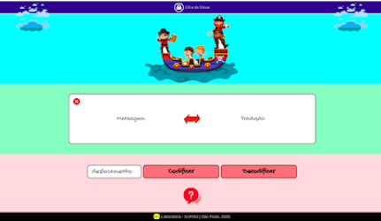

## Índice
* [0. Página do projeto](#0.pagina-do-projeto)
* [1. Contextualização](#1-contextualização)
* [2. Resumo do projeto](#2-resumo-do-projeto)
* [3. Funcionalidades](#3-funcionalidades)
* [4. Ferramentas utilizadas](#4-ferramentas-utilizadas)
* [5. Scripts e Arquivos](#5-scripts-e-arquivos)
* [6. Instalação](#6-instalação)
* [7. Autora](#7-autora)
* [8. Agradecimentos](#8-agradecimentos)
* [9. Créditos](#9-creditos)


 ## 0.Link do projeto
 :pushpin:  Clique [aqui](https://nmonalisa.github.io/SAP004-cipher/) para acessar o webapp.


## 1. Contextualização :paperclip:
Cifrar significa codificar. A [cifra de
César](https://pt.wikipedia.org/wiki/Cifra_de_C%C3%A9sar) é um dos primeiros
tipos de criptografias conhecidas. O imperador romano Júlio César
utilizava essa cifra para enviar ordens secretas aos seus generais no campo de
batalha. É um
tipo de cifra por substituição, em que cada letra do texto original é
substituida por outra que se encontra há um número fixo de posições
(deslocamento) mais a frente do mesmo alfabeto, como mostra a figura abaixo.


## 2. Resumo :mag:
O objetivo do projeto é construir um ambiente de criptografagem para mensagens usadas como pistas em jogos infantis do tipo ___Caça ao Tesouro___. A codificação das palavras foi baseada no método da __Cifra de César__. A aplicação é voltada para o público infantil e se propõe a ser simples, intuitiva e lúdica. Espero que os adultos usem a página para codificar as dicas/pistas que fornecerão às crianças para que elas descubram onde está escondido o tesouro. Ao mesmo tempo, espero que as crianças sejam capazes de utilizar a página para decodificar as pistas que recebem dos mentores do jogo. A ideia é trazer aum jogo clássico e divertido um pouco mais de interatividade e dinamicidade através do uso de recursos virtuais.

## 3. Funcionalidades 	:hammer:
A interface é composta pela área de texto, chave de deslocamento, botões de submissão de texto e botão 'Ajuda'. Para codificar uma pista,o usuário deverá inserir uma mensagem na caixa 'Texto' e registrar quantas casas de deslocamento irá utilizar para a criptografagem. Então deverá utilizar o botão 'Codificar' para gerar o texto criptografado. Para descobrir qual é o texto original, o usuário que recebe a pista codificada deve usar o botão 'Decodificar'. A pessoa que fornece a pista não deve se esquecer de fornecer também a chave de deslocamento usada na codificação, pois a tradução só será precisa se o mesmo deslocamento for utilizado para codificar e decodificar o texto. O botão 'Ajuda' fornece dicas básicas de uso da aplicação. Veja uma imagem da interface do usuário abaixo:<br>


## 4. Ferramentas utilizadas :wrench:
* [Node.js](https://nodejs.org/en/) - usado como plataforma de aplicação 
* [NPM](https://www.npmjs.com/) - usado como gerenciador de pacotes
* [Google Fonts](https://fonts.google.com/) - usado para estilização da fonte
* [Jest](https://jestjs.io/pt-BR/) - usado como framework de testes unitários
* [FlatIcon](https://www.flaticon.com/) e [Freepik](https://br.freepik.com/) - distribuição de imagens livres
* [Figma](https://www.figma.com/) - usado na prototipação do projeto

## 5. Scripts e Arquivos :open_file_folder:
```
├── README.md
├── package.json
├── src
|   |__ assets
|   ├── cipher.js
│   ├── index.html
│   ├── index.js
│   └── style.css
└── test
    ├── .eslintrc
    └── cipher.spec.js
```
* package.json: contém informações sobre versão, licença e dependências de pacotes do projeto.
* src/assets: contém o protótipo e as imagens de capa.
* src/cipher.js: contém o objeto cipher, que possui dois métodos: __cipher.encode(offset, string)__: usado para codificar o texto, e __cipher.decode(offset, string)__: usado para traduzir a mensagem codificada. _Offset_ é o número de posições que queremos mover para a direita no alfabeto durante a substituição de letras. _String_ é a mensagem (texto) que queremos decifrar.
* src/index.html: arquivo com a marcação HTML e link para os arquivos CSS e JS.
* src/index.js: importa o objeto cipher.js e implementa as demais funcionalidades.
* src/style.css: arquivo com a estilização.
* test/cipher.spec.js: configuração dos testes unitários.

## 6. Instalação :computer:
Certifique-se de possuir o Node.js instalado:
```
node -v
```
Certifique-se de possuir o npm instalado:
```
npm -v
```
Instale as dependências (listadas no arquivo package.json) do projeto no seu diretório local:
```
npm install
```
Inicialize a aplicação (index.html) no seu servidor local (localhost):
```
npm start
```
Se quiser, realize os testes unitários:
```
npm test
```
Faça o deploy do projeto para o servidor online (gitpages):
```
npm run deploy

```

## 7. Autora :email:
Nathalia Monalisa Francisco: nathaliamonalisa@gmail.com 

## 8. Agradecimentos  :raising_hand:	:yellow_heart: 	:blue_heart:
Colegas de #Squad5 (Luana, Marcela, Mari, Marjorie, Milena, Naere, Natasha, Nathalia) e equipe Laboratoria, em especial Palomita e Mônica.

## 9. Créditos:
* Imagem do background (navio pirata): vetor criado por brgfx - br.freepik.com
* Imagem do botão 'Ajuda': Icon made by Freepik from www.flaticon.com"
